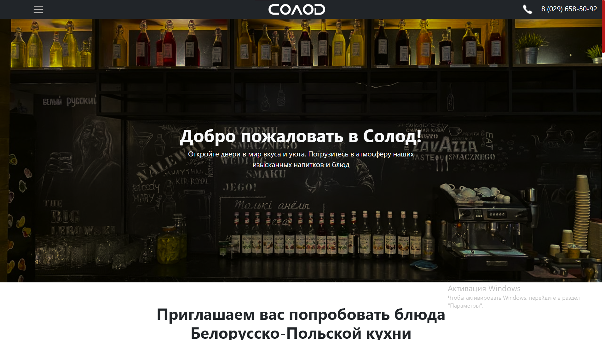
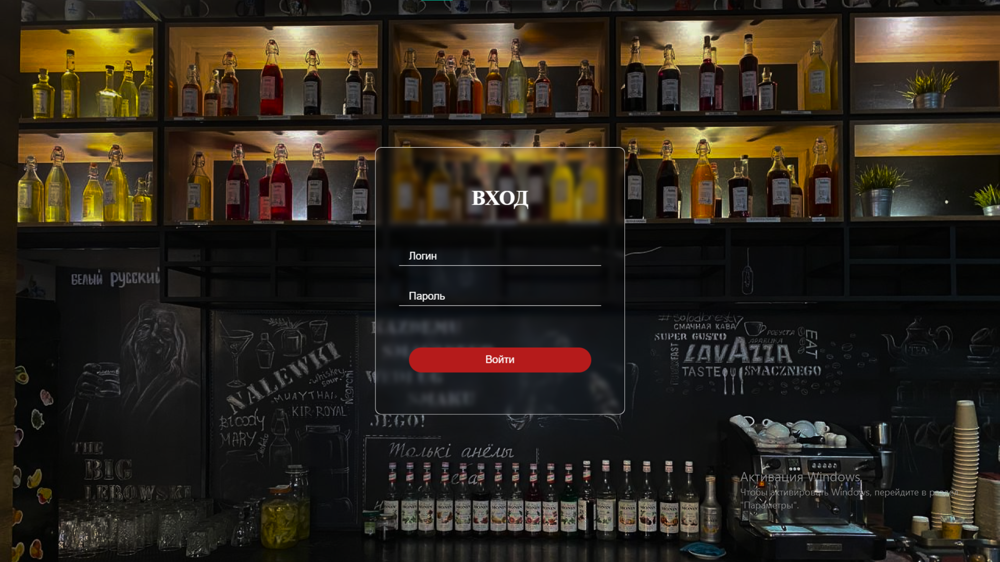

# solod

[Солод](https://m-web-jan.github.io/solod/) - уникальное заведение в городе Бресте. "Солод" предлагает посетителям уютную атмосферу, разнообразное меню с блюдами европейской и белорусской кухни, а также широкий выбор напитков, включая крафтовое пиво и авторские настойки. Идеальное место для встреч с друзьями, романтических вечеров и проведения корпоративных мероприятий.

----

# Деплой
Фронт приложения вы можете просмотреть здесь:
[Солод](https://m-web-jan.github.io/solod/)




----
## Цели проекта

Целью создания сайта для кафе-бара "Солод" является предоставление удобной и информативной онлайн-платформы для гостей. Сайт позволит представить меню с описаниями блюд и напитков а также будет информировать о акциях, предложениях и событиях. Это поможет улучшить имидж кафе-бара и повысить удовлетворенность наших гостей, укрепляя позиции "Солода" на рынке.

----

## Стек технологий

* HTML, CSS, JavaScript.
* NodeJs

----

## Установка
**Рекомендуемый IDE: VS Code**

**npm v 18.17.0 и выше**
*Если у вас нет node.js и установите npm отсюда : [Node.js](https://nodejs.org/en/download)*

* Открыть проект в VS Code

* Установить зависимости
```
npm install
// или
npm i
```

## Применение
### Для запуска фронта:
```
Live server
```
---
### Запуск бэкенда для сайта "Солод"

Для запуска бэкенда выполните следующие шаги:

1. **Создание базы данных:**
   - Создайте базу данных с именем `solod`.
   - Импортируйте базу данных в phpMyAdmin из файла, который находится в корневой директории проекта.

2. **Установка и настройка Open Server:**
   - Скачайте и установите Open Server с официального сайта.
   - Запустите Open Server и откройте панель управления.
   - В настройках выберите PHP и MySQL версии, которые требуются для вашего проекта.

3. **Запуск бэкенда:**
   - Перейдите в директорию `solod`.
   - Выполните команду:
     ```
     node js/main.js
     ```

4. **Открытие админ-панели:**

   - После запуска бэкенда, админ-панель будет доступна по адресу:
   `http://127.0.0.1:5500/admin/`
   

### Подробное руководство по шагам:

1. **Создание базы данных `solod`:**
   - Откройте phpMyAdmin через Open Server (обычно доступно по адресу `http://localhost/phpmyadmin`).
   - Войдите в систему, используя свои учетные данные.
   - Создайте новую базу данных с именем `solod`.
   - Перейдите на вкладку "Импорт" в phpMyAdmin.
   - Выберите файл `solod.sql` из корневой директории проекта и импортируйте его.

2. **Установка и настройка Open Server:**
   - Скачайте Open Server с [официального сайта](https://ospanel.io/).
   - Установите Open Server, следуя инструкциям на экране.
   - Запустите Open Server и откройте панель управления.
   - Перейдите в настройки Open Server.
   - Выберите необходимые версии PHP и MySQL (указанные в вашем проекте).

3. **Запуск бэкенда:**
   - Откройте командную строку (или терминал).
   - Перейдите в директорию проекта, где находится папка `js/`, используя команду:
     ```
     cd solod
     ```
   - Запустите бэкенд, выполнив команду:
     ```
     node js/main.js
     ```